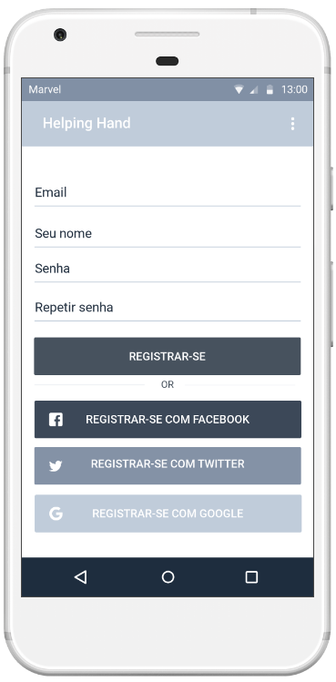
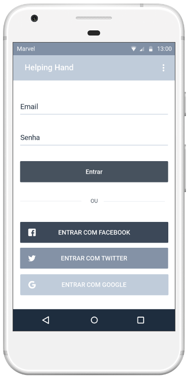
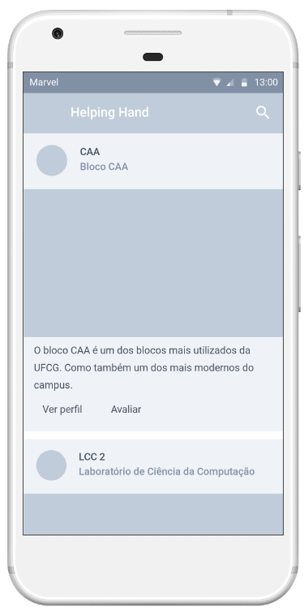
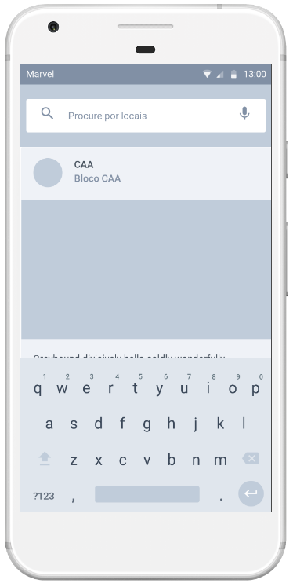
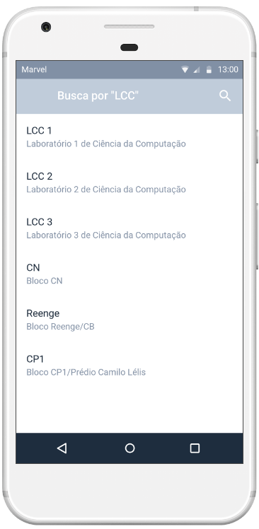
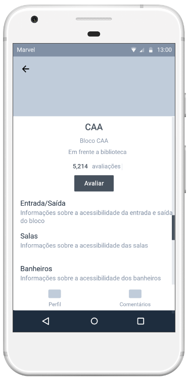
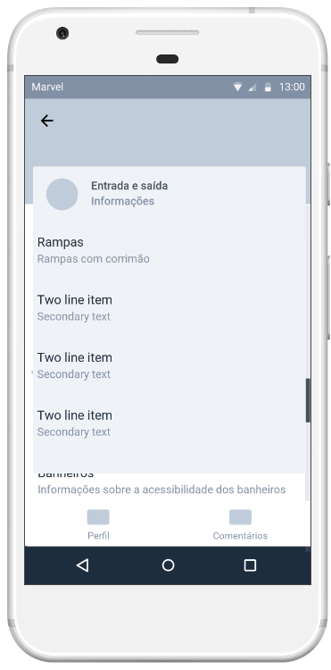
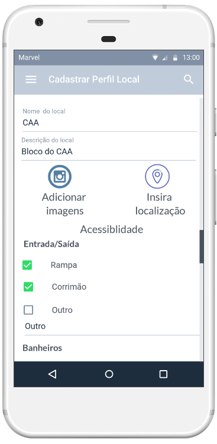

# Prototipação

## Exemplos de algumas telas da aplicação

### Tela de Cadastrar:

### Tela de Login:

### Tela de Início:

### Tela de Buscar por locais:

### Tela de Listagem dos locais buscado:

### Tela de Perfil de um local:

### Tela de Comentários:

### Tela de Categoria de um perfil:

### Tela de Cadastrar um novo perfil:

